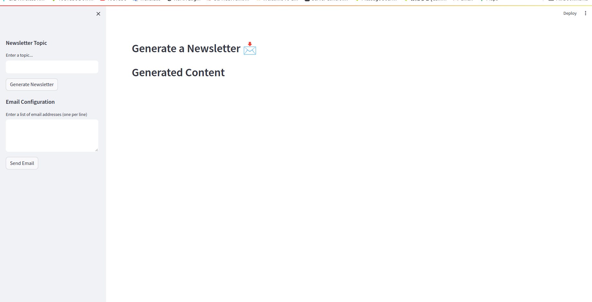

# Project Name

## Newsletter Generator



## Overview

The Automated Newsletter Generator allows users to effortlessly create newsletters on any topic, leveraging online content. The application utilizes the OpenAI API for content generation and the Serper API for online content search. Users can input a topic of interest, and the application will generate a curated newsletter based on relevant online articles. Additionally, users can edit the generated content, input a list of email addresses, and send the newsletter directly from the application.

## Table of Contents

- [Installation](#installation)
- [Usage](#usage)
- [Configuration](#configuration)
- [API Keys](#api-keys)
- [License](#license)

## Installation

To replicate the project locally, follow these steps:

1. Clone the repository:

   ```bash
   git clone https://github.com/george-mountain/Automated-Newsletter-Generation-APP.git
   ```

2. Navigate to the project directory:

   ```bash
   cd Automated-Newsletter-Generation-APP
   ```

3. Create and activate a virtual environment:

   ```bash
   python -m venv venv
   source venv/bin/activate  # For Linux/Mac
   # or
   .\venv\Scripts\activate  # For Windows
   ```

4. Install dependencies:

   ```bash
   pip install -r requirements.txt
   ```

5. Create a `.env` file and add your API keys following the example in `.env-sample` file in this repo.

## Usage

Run the application using the following command:

```bash
streamlit run app.py
```

Visit the displayed URL in your web browser to access the application.

## Configuration

### Newsletter Topic

1. Enter the desired topic in the text input field.
2. Click the "Generate Newsletter" button to initiate the content generation process.

### Email Configuration

1. Enter a list of email addresses, one per line, in the provided text area.
2. Click the "Send Email" button to send the generated newsletter to the specified email addresses.

## API Keys

Obtain the necessary API keys to enable content generation and online searching:

- **OpenAI API Key:** [Get OpenAI API Key](https://openai.com/blog/openai-api)
- **Serper API Key:** [Sign up for Serper API](https://serper.dev/signup)


## License

This project is licensed under the MIT License - see the [LICENSE](https://opensource.org/license/mit/) file for details.